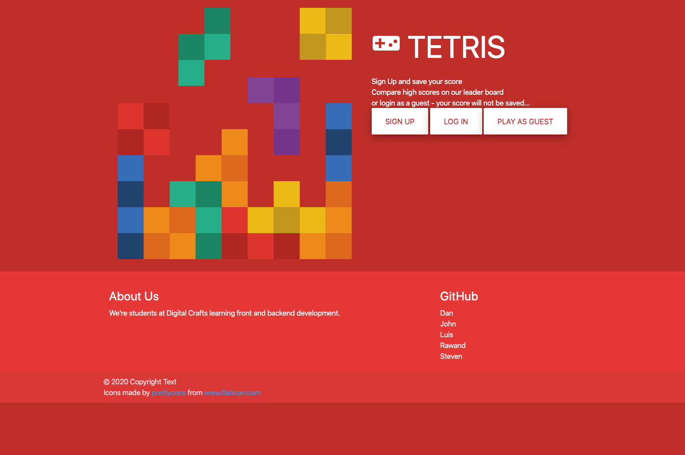

# Tetris
* **Purpose of the application:**
   A hyper-casual web puzzle game incorporating user registration and authentication, a chat feature, persisted scores, multiplayer interaction, and smooth, addictive gameplay in the users favorite web browser on mobile device or the desktop.

* **How to use:**
   Desktop uses the keyboard controls arrow Left: move left; arrow Down: drop one row; arrow Right: move right; Q: rotate counter-clockwise; W: rotate clockwise; R: fast drop

   Mobile uses taps to the left or right of the falling piece to move; taps below the falling piece to drop one row; and the rotate and fast drop buttons below the game board to perform those functions.

* **Features of the application:**
   A user may register and login with a username and password (their score will be posted to the leaderboard) or use the guest login button on the landing page to play anonymously (scores will not be persisted).  As a player completes rows and scores points, the level automatically increases and the pieces begin falling faster.  In multiplayer mode, when any player completes a row a new row with a random block missing is sent to the bottom of the game board of every other player currently playing the game.  A registered user is shown their score and their highest score acheived.  The top ten highest scores and associated levels are shown on the leaderboard.  From the leaderboard screen a user can see the number of users currently playing, the number of users viewing the leaderboard, and can send messages to all other users currently viewing the leaderboard.

## Site Preview

## Live link:
- [Tetris](https://powerful-ravine-73143.herokuapp.com/)

## This application was built by
- [Rawand Dargali](https://github.com/rdargali)
- [Steven Mendez](https://github.com/blond3d)
- [Dan Ochs](https://github.com/DanOchs99)
- [John Pham](https://github.com/johnpham47)
- [Luis Pladano](https://github.com/LmPladano)

## Database:
- PostgreSQL

## Project dependencies:
- Node.js, Express.js

- bcrypt, dotenv, express-session, mustache-express, pg-promise, socket.io

- Utilizes the Materialize front-end framework

